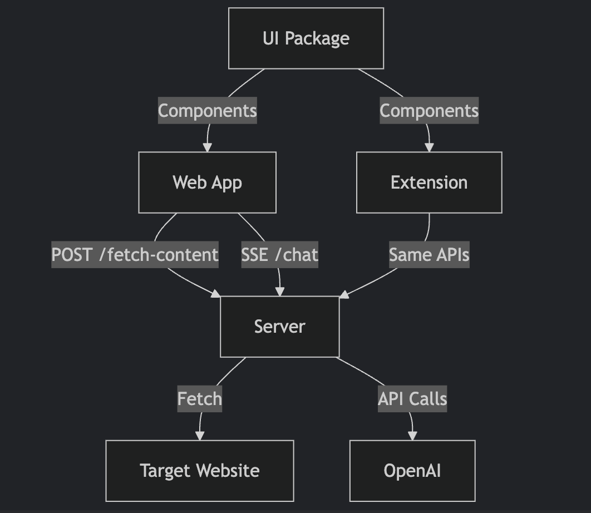

# Chat with Webpage

A web app and Chrome extension that lets users chat with the content of web pages, powered by OpenAI.

## Current Features

✅ Web app with URL input and chat interface  
✅ Chrome extension with page context analysis  
✅ Shared UI components between web and extension    
✅ Proxy server for content fetching and OpenAI API  
✅ Real-time streaming responses  
✅ Context-aware answers (stays on topic)  
✅ Suggested questions based on content    
✅ Auto-scrolling chat interface  

## Project Structure (Monorepo)
```
chat-with-webpage/
├── packages/
│   ├── web-app/          # React Vite frontend
│   ├── server/           # Express proxy server
│   ├── extension/        # Chrome extension (COMPLETED)
│   └── ui/               # Shared UI components
├── package.json          # Root workspace config
└── README.md
```


## Setup Instructions

### Prerequisites
- Node.js v18+
- pnpm (`npm install -g pnpm`)
- OpenAI API key
- Chrome browser (for extension testing)

### Installation
1. Clone the repository
2. Install dependencies:
   ```bash
    git clone [your-repo-url]
    cd chat-with-webpage
    pnpm install
   ```

### Environment Setup
1. Create .env in packages/server:
    ```env
    OPENAI_API_KEY=your_api_key_here
    PORT=3001
    ```

## Running the Project

### Development
    ```bash
    # Start both web app and server
    pnpm dev

    # Or run separately:
    pnpm dev:web    # Web app (http://localhost:5173)
    pnpm dev:server # API server (http://localhost:3001)
    pnpm dev:ext    # Extension (watches for changes)
    ```

## Production Build
    ```bash
    pnpm build
    ```

## Loading the Chrome Extension
1. Build the extension:
```bash
pnpm --filter @chat-with-webpage/extension build
```
2. In Chrome:
- Navigate to chrome://extensions
- Enable "Developer mode"
- Click "Load unpacked" and select packages/extension/dist

## Key Implementation Details

### Web App
- Built with React + Vite
- Handles:
    - URL input and validation
    - Streaming chat interface
    - Responsive design

## Chrome Extension
- Manifest v3
- Components:
    - Content script for DOM analysis
    - Popup chat interface
    - Background service worker
    - Uses same API server as web app

## Shared UI Package
- Reusable components:
    - Message - Chat bubble
    - SuggestedQuestions - Context-aware prompts
    - Chat - Core chat interface

### Server
- Express.js API endpoints:
    - `POST /api/fetch-content` - Fetches and cleans webpage content
    - `POST /api/chat` - Handles OpenAI chat completions
- Features:
    - CORS management
    - Secure API key handling
    - Content cleaning and preprocessing


## Future Work
### 1. Enhancements:
- Chat history persistence
- Rate limiting on API
- Better error handling

### Later Features
- User authentication
- Shared chat links / Cross-device chat history sync


## Troubleshooting
### Common Issues:
- Failed to fetch content: Check CORS and network connectivity
- API errors: Verify OpenAI key and quota
- Streaming issues: Ensure proper SSE client handling

## Architecture Diagram


## Maintainer Notes
- **Development Flow:**:
    1. Make changes in respective packages
    2. Rebuild affected packages (pnpm --filter [package] build)
    3. Refresh extension in Chrome if needed
- **Key Files:**:
    1. packages/ui/src/components/* - Shared UI components
    2. packages/server/src/index.ts - API endpoints
    3. packages/extension/src/content-script.ts - Page analyzer
- **Testing:**:
    1. Web: Test with various URLs
    2. Extension: Test on different site types
    3. API: Use Postman for endpoint verification


## Demo videos
1. ⁠On the webpage itself : https://youtu.be/lVBf-zVKTvs
2. ⁠⁠On the browser extension : https://youtu.be/SXnecLT9gkI
3. web-app demo video from the beginning : https://youtu.be/XhCV2k2ihzo
